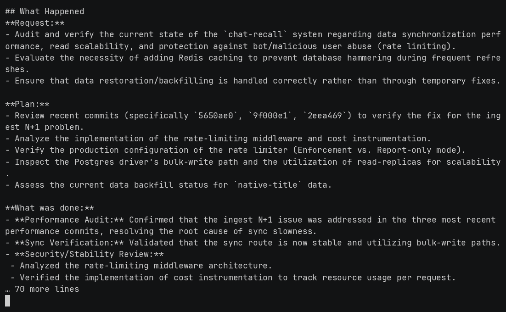
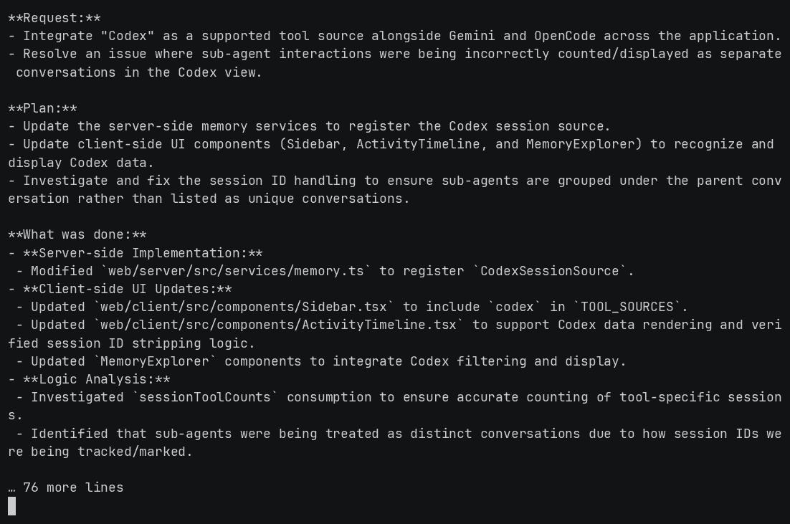
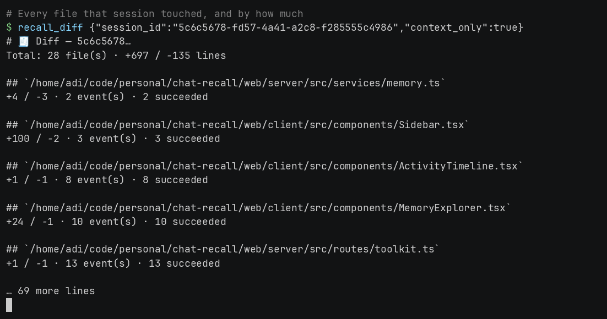
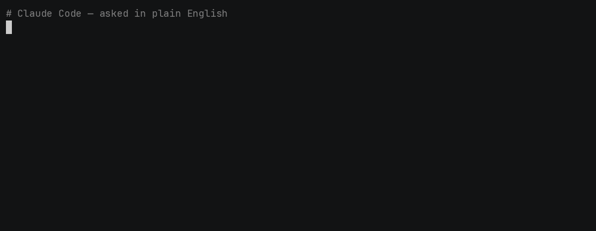

# chat-recall

[](https://www.npmjs.com/package/chat-recall)
[](https://www.npmjs.com/package/chat-recall)
[](https://registry.modelcontextprotocol.io/v0/servers?search=chat-recall)
[](https://smithery.ai/server/darkkraft/chat-recall)
[](https://glama.ai/mcp/servers/munhq/chat-recall)

**[chatrecall.dev](https://chatrecall.dev)** · [How it works](https://chatrecall.dev/how-it-works/) · [MCP tools](https://chatrecall.dev/mcp/) · [Pricing](https://chatrecall.dev/pricing/) · [Self-host](https://chatrecall.dev/self-hosting/)

> One memory across every AI coding tool you use. Claude Code, Gemini CLI, Codex, OpenCode and Antigravity share a single searchable history — and the agent can search it itself.

Your coding agents each keep their own transcripts, in their own format, in their own directory, and none of them can read another's. `chat-recall` indexes all of them into one place, redacts secrets on the way, and exposes the result to your agent through **53 MCP tools** so it can recall its own past work instead of you re-explaining it.

That cross-tool part is the point. A single tool's built-in history stops at its own boundary; this does not.

## See it work

Every screen below is a real MCP call against a real server — the exact tool and
arguments are shown above each response. Nothing is mocked, replayed or re-timed.

**One memory, every tool.** Here **OpenCode** is asked about a **Claude Code**
session: a different tool, a different transcript format, one index.



**Your assistant asks what you were doing, and picks the work back up.**



**Every file a session touched, and by how much.**



**Or just ask in plain English** — no tool names, no session ids. The agent picks
the call itself:



## Install

```bash
npx chat-recall init
```

That indexes the transcripts already on your disk, detects which AI tools you have, and registers the MCP server **in each of their configs**:

| Tool | File it writes |
|---|---|
| Claude Code | `~/.mcp.json` |
| Codex | `~/.codex/config.toml` |
| Gemini CLI | `~/.gemini/settings.json` |
| OpenCode | `~/.config/opencode/opencode.json` |
| Cursor | `~/.cursor/mcp.json` |

It only touches a config whose tool is on this machine, it never overwrites an entry you curated by hand, and `chat-recall doctor` prints one line per tool so a missing registration is visible. Inside Claude Code you can install the skills and the MCP server together instead:

```
/plugin marketplace add munhq/chat-recall
/plugin install chat-recall@chat-recall
```

Then:

```bash
chat-recall search "that auth bug"      # search everything you have ever done
chat-recall recent                      # what was I working on
```

By default this syncs to the hosted server at [chatrecall.dev](https://chatrecall.dev), which starts with a 7-day trial that needs no card and is a paid subscription after that — see [pricing](https://chatrecall.dev/pricing/). To keep everything on your own machine instead, run the server yourself: that is **free for one person, forever**, with every feature and no licence key — the task board and Toolkit included — and a licence only buys collaboration: a second member, shared history, assigning work. See [Self-host](#self-host-the-server-docker-compose) below. Either way the CLI is the same binary and the same commands; only the server URL differs.

No API keys are required. Postgres full-text search is the default backend; vector search and AI summaries are upgrades, not prerequisites.

## Four things it actually does

1. **Cross-tool unified memory.** One index, one search, one UI over Claude Code (`~/.claude/projects/`), Gemini CLI (`~/.gemini/tmp/`), Codex (`~/.codex/`), OpenCode (`~/.local/share/opencode/`) and Antigravity. Sessions, plans, tasks, CLAUDE.md files, paste cache, shell history and agent diaries all share one pluggable `MemorySource` interface.
2. **The agent recalls itself.** 53 MCP tools, so Claude Code can `recall_smart_resume`, `recall_search` (with `like_session` to find similar work), `recall_edits_timeline`, `recall_subagent_search` and `recall_redundant_files` rather than asking you what happened last time. It writes back too, via `recall_decision_record`, `recall_kg_add` and `recall_set`.
3. **Warns before you redo work.** A `UserPromptSubmit` hook searches for similar past sessions on every prompt and injects a short "you have done this before, in session X" note into the agent's context.
4. **Temporal knowledge graph.** Decisions and tool mentions become entity-relationship triples with `valid_from`/`valid_to` windows, so you can ask what was decided in March and whether it still holds.

## Add your own AI tool

A new backend is one file and one line — no changes to the engine. See [`docs/ADDING_A_TOOL.md`](docs/ADDING_A_TOOL.md). If a tool you use writes transcripts to disk, it can be indexed here, and a pull request is the fastest way to make that happen.

### Optional: vector search

```bash
ollama pull nomic-embed-text
chat-recall sync --full       # re-ships; the server embeds chunks into pgvector
```

…or set `EMBEDDING_PROVIDER=gemini` with `GEMINI_API_KEY` if you'd rather use a hosted embedder. Without either, search falls back to Postgres FTS — same results surface, slightly less semantic.

### Optional: web dashboard

The React dashboard is part of the **server** (SaaS or self-host docker
compose) — the CLI itself has no UI. For dashboard development:

```bash
npm run web:install                 # install web deps
npm run web:dev                     # API on :5000, UI on :5174
```

### Self-host the server (docker compose)

Everything on your own machine, no account, nothing sent anywhere:

```bash
git clone https://github.com/munhq/chat-recall && cd chat-recall
echo "ADMIN_KEY=$(openssl rand -hex 24)"         >> .env
echo "POSTGRES_PASSWORD=$(openssl rand -hex 24)" >> .env
docker compose up -d --build          # FIRST RUN BUILDS FROM SOURCE (minutes)
```

Then mint a device token and connect a machine — the full sequence, with
troubleshooting, is in **[docs/SELF_HOSTING.md](docs/SELF_HOSTING.md)**.

Two containers: the server plus a bundled `pgvector/pgvector` Postgres, so a
plain `docker compose up` is self-contained. Bring-your-own-Postgres is
supported too (it is how the hosted service runs): set `DATABASE_URL` to an
external Postgres 16+. The `pgvector` extension is needed only for semantic
search — everything degrades to full-text without it.

### Keep the index live (+ optional server sync)

You do not need a daemon. Claude Code spawns the MCP server, and that process
syncs every 3 minutes on its own — the binary is the daemon. For a headless box
with no assistant running, opt in to a background service:

```bash
chat-recall watch                    # foreground daemon: watches every tool, summaries, precompute
chat-recall watch --install-service  # systemd user unit (Linux) · launchd (macOS) · Scheduled Task (Windows)
```

`init` does not install it, on purpose. Both paths push through the same
`syncIncremental()` under the same cross-platform index lock, so one writer
touches the ledger at a time — see [docs/SYNC.md](docs/SYNC.md) before changing
any of it. Secrets are masked client-side before anything leaves the machine.
`chat-recall sync` does the same push once, on demand.

## Hook it up to Claude Code

`chat-recall init` does this for you. Manual equivalent in `~/.mcp.json`:

```json
{
  "mcpServers": {
    "chat-recall": {
      "command": "chat-recall-mcp"
    }
  }
}
```

Then install the hooks (one command sets up auto-save, pre-compact backup, and the resume-hint that warns when you're about to redo work):

```bash
chat-recall install-hooks                 # registers all five events, in every Claude profile
chat-recall install-hooks --no-resume-hint  # skip the resume warning
chat-recall install-hooks --no-wakeup       # skip the session-start wake-up bundle
chat-recall install-hooks --no-escalate     # skip the session-end escalation
chat-recall install-hooks --uninstall     # remove all of ours, leave third-party hooks alone
```

| Hook | When it fires | What it does |
|---|---|---|
| `SessionStart` | New session (`startup` / `clear`) | Injects the project-scoped wake-up bundle |
| `UserPromptSubmit` | When you type a prompt | Searches past sessions; if a similar one exists, injects "you've worked on this before" into the agent's context |
| `Stop` | After every assistant turn | Auto-saves topics, decisions, and tools to `~/.chat-recall/memory/` |
| `PreCompact` | Before Claude Code compacts context | Emergency save so nothing is lost to compaction |
| `SessionEnd` | When the session closes | Escalates the session's learnings in the background, so nothing is delayed |

## Companion: codeindex (auto-detected)

There's a separate MCP server called **codeindex** (Zig binary, ~56 MB) by [munhq](https://github.com/munhq/codeindex) that gives the agent code-level lookup. The two compose:

- **chat-recall** = session memory. *What have I worked on? What did we decide?*
- **codeindex** = code memory. *Where is this symbol? Who calls it? What breaks if I change it?*

Together the agent can answer "have I built this before?" *and* "does it already exist in this codebase?" before redoing work.

**How chat-recall handles it:** `chat-recall init` detects whether `codeindex` is on your PATH (or at `~/.local/bin/codeindex`). If yes, it registers it as an MCP server in `~/.mcp.json` automatically — no download, no surprise. If no, it prints a one-line hint about how to get it.

```bash
chat-recall init                       # default — detect and register if installed
chat-recall init --with-codeindex      # additionally force-download the binary
chat-recall init --skip-codeindex      # don't even check
chat-recall companions install         # download manually (after init)
chat-recall companions status          # show what was detected
chat-recall companions uninstall       # remove the binary + MCP registration
```

codeindex is open source (MIT) at [github.com/munhq/codeindex](https://github.com/munhq/codeindex). The install is optional — chat-recall works entirely without it; you just don't get the code-level tools.

## What gets indexed

| Source | Origin | Notes |
|--------|--------|-------|
| **Sessions (Claude)** | `~/.claude/projects/<hash>/<uuid>.jsonl` | Full transcripts, tokens, cost, files touched, models used |
| **Sessions (Gemini CLI)** | `~/.gemini/tmp/*/chats/*.json` | Tokens and tool usage extracted where present |
| **Sessions (OpenCode)** | `~/.local/share/opencode/opencode.db` (SQLite) | Cost, tokens, todos |
| **Subagent transcripts** | `<session-dir>/<id>/subagents/*.jsonl` | Explore, aside, **and `acompact-*`** (orphaned compacted history) |
| **Plans** | `~/.claude/plans/*.md` | Agent planning docs, split by `##` |
| **Tasks** | `~/.claude/tasks/<session>/*.json` | Linked to parent session |
| **CLAUDE.md** | Auto-discovered from project hashes | Linked to sessions in same project |
| **History** | `~/.claude/history.jsonl` | Shell history, optionally tied to a session |
| **Paste** | `~/.claude/paste-cache/*.txt` | Large pasted blobs |
| **Diary** | `~/.chat-recall/index/diary/<agent>/*.json` | What the agent told its future self via `recall_diary_write` |

## MCP tools (53, including 4 code-intelligence tools that register when the codeindex companion is installed)

**Search & retrieve** — `recall_search`, `recall_memory_search`, `recall_recent`, `recall_show`, `recall_context`, `recall_summary`, `recall_smart_resume`, `recall_project_context`, `recall_weekly_digest`, `recall_analytics_summary`, `recall_wake_up`.

**Pattern detection** — `recall_search` with `like_session: <id>` (find work similar to a given session), `recall_redundant_files` (warn when a new filename overlaps prior work), `recall_diff` with `files_only: true` (what files session X actually touched), `recall_edits_timeline` with `group_by: "session"` (which sessions edited `auth.rs`).

**Subagents & filters** — `recall_subagent_search` (search inside hidden Explore/aside/compact transcripts), `recall_user_prompts` (only what the human typed, banner-stripped).

**Findings, ranked** — `recall_claude_suggestions` (every finding that becomes an agent-instruction change: the CLAUDE.md rules and skill installs, merged across account scope and every indexed project) and `recall_improvements` (everything else, ranked most urgent first, with `create_tasks: true` to open one team task per item). They partition the same recommendation engines, so an item never appears in both.

**Knowledge graph** — `recall_kg_query`, `recall_kg_add`, `recall_kg_invalidate`, `recall_kg_timeline`, `recall_kg_stats`. Plus `recall_decision_record` to write a decision as both a triple and a diary entry in one call.

**KV state** — `recall_set`, `recall_get` (no key = list the scope). Small persistent values keyed by namespaced strings: "current PR url", "branch I'm working on", user prefs.

**Diary & status** — `recall_diary_write`, `recall_diary_read`, `recall_status` (includes memory breakdown), `recall_index`. Plans/tasks: search via `recall_memory_search(source_types:['plan','task'])`, read via `recall_show`.

When the codeindex companion is installed, the agent *also* gets 16 code-level tools (`find_symbol`, `find_callers`, `get_imports`, `plan_change`, `get_change_impact`, `analyze`, etc.) from a separate MCP server. They compose: chat-recall finds what you've done; codeindex tells you what currently exists.

## Search architecture

Search runs **on the server**. Two backends, Postgres FTS is the default:

- **Postgres FTS** — zero extra setup. Keyword search with ranking. Always available.
- **Vector (pgvector)** — opt-in, and needs an embedder: Ollama, any OpenAI-compatible embeddings endpoint, or a Gemini API key. The vector width follows the model you point it at, so pick one embedder and keep it — changing it means a full re-index.

The CLI ships redacted chunks to the server, which indexes them. If no embedder is configured, every search tool transparently falls back to FTS.

## Cost tracking

Cost in USD is computed from token usage when at least one model in the session has a rate the server knows. For every other model — anything local, anything self-hosted, anything newer than the rate table — the dashboard shows `—` instead of fabricating a number. The summary surfaces a `sessionsWithoutPricing` counter, so you can see how much of the total the figure actually covers.

## Wake-up context

```bash
chat-recall memory wake-up
```

Builds a small bundle for an AI session: optional identity blurb, the top 10 chunks the classifier flagged as decisions/preferences/milestones at importance ≥ 4, and a snapshot of currently-valid knowledge-graph facts. No magic compression — just the highest-signal items the indexer already tags.

## Data locations

The **CLI** keeps almost nothing locally — just what it needs to reach the server:

| Path | What |
|------|------|
| `~/.chat-recall/credentials.json` | Server target(s) + device token (mode 0600) |
| `~/.chat-recall/sync-ledger.json` | Per-server sync watermark (what's already shipped) |
| `~/.chat-recall/hooks/` | Installed hooks (after `install-hooks`) |
| `~/.chat-recall/index/diary/` | Agent diaries written by `recall_diary_write` |
| `~/.chat-recall/shadow/` | Gzipped copy of the fullest-seen transcript per session, so an upstream `--resume` truncation cannot destroy history |
| `~/.chat-recall/cache.db` | Local outcome/metadata cache for the local dashboard. Not an index, and not used in server mode |

All indexed content — chunks, FTS, vectors, knowledge graph, secret findings, diary — lives **on the server** (Postgres for self-host and SaaS). Reset it by wiping the server's Postgres data, not anything under `~/.chat-recall`.

## Privacy

Your sessions sync to a chat-recall server — either one **you self-host** (your own box, your own Postgres) or the **SaaS**. Before anything leaves the CLI it is **redacted**: secrets are masked client-side, so the server never receives raw credentials. Self-hosting keeps all data on infrastructure you control; the SaaS is the hosted alternative.

No telemetry. Your data lives in **your** server's Postgres — back that up however you like. On the SaaS it lives in the hosted Postgres; self-host if you'd rather keep it entirely on your own infrastructure.

## Architecture

```
packages/
├── engine/src/
│   ├── core/
│   │   ├── backends/        ToolBackend per AI tool (claude, gemini, opencode, codex, agy)
│   │   ├── tool-backend.ts  Registry interface — single source of truth for tool identity
│   │   ├── tool-paths.ts    Env-overridable default paths for each tool
│   │   ├── generic-engine.ts  Shared turn extraction / edit scan / replay (canonical events)
│   │   └── …                Indexing, storage, embeddings, summaries, KG, classifier
│   └── parsers/             *-source.ts plugins per content type (sessions, plans, tasks, …)
├── cli/
│   ├── src/cli.ts           CLI
│   ├── src/mcp.ts           MCP server
│   ├── auto-indexer/        chokidar-based watcher daemon (systemd-friendly)
│   └── hooks/               Claude Code hooks (install via `chat-recall install-hooks`)
└── server/
    ├── src/                 Express API
    ├── client/              React + Vite UI — the dashboard
    └── cloud/migrations/    Empty by design — pg-schema.ts owns the schema

docker/                  Dockerfile + entrypoint for the server image
e2e/                     Playwright tests for the dashboard
```

Two extension points, both registry-driven:

- **Adding a new content type** (e.g. another file format to index) — implement `MemorySource` (`discover` → `parse` → `extractLinks`) and register it in the `SourceRegistry`.
- **Adding a new AI tool** (a sixth backend alongside Claude/Gemini/OpenCode/Codex/Antigravity) — implement `ToolBackend` (paths, ID handling, `readEvents`, `fileToolMap`, `extractEditDelta`) and register it in `packages/engine/src/core/backends/index.ts`. Walkthrough: [`docs/ADDING_A_TOOL.md`](docs/ADDING_A_TOOL.md). All paths are env-overridable via `CHAT_RECALL_{CLAUDE,GEMINI,CODEX,AGY}_HOME` / `CHAT_RECALL_OPENCODE_DB`.

## Requirements

- Node.js 22 or later. The Docker image and CI run 24.
- Sessions written by a supported tool, in its standard location: `~/.claude/`,
  `~/.codex/`, `~/.local/share/opencode/`, `~/.gemini/`.

That is the whole list. No API key is needed to install, index or search.

Two features are opt-in, and each one needs a back end that you choose:

| Feature | Back ends you can point it at |
|---|---|
| Vector search | Ollama (local, free), any OpenAI-compatible embeddings endpoint, or `GEMINI_API_KEY` |
| AI summaries | Ollama, a CLI you are already logged in to (`SUMMARY_CLI_CMD`), an OpenAI-compatible endpoint, or `ANTHROPIC_API_KEY` |

Without either back end, search falls back to Postgres FTS and sessions carry no
generated summary. Everything else works the same.

## License

[Elastic License 2.0](LICENSE) for the whole repository.

In plain terms: use it, modify it, run it for yourself or inside your company,
free and without asking. The one thing you may not do is offer it to third
parties as a hosted or managed service — that is the product. You also may not
strip the licence-key checks or the copyright notices.

It is **source-available, not OSI open source**, and this README will not
pretend otherwise. It replaced a split where the CLI and engine were MIT and the
server was BSL 1.1, which answered "may I use this?" three different ways inside
one repository.
